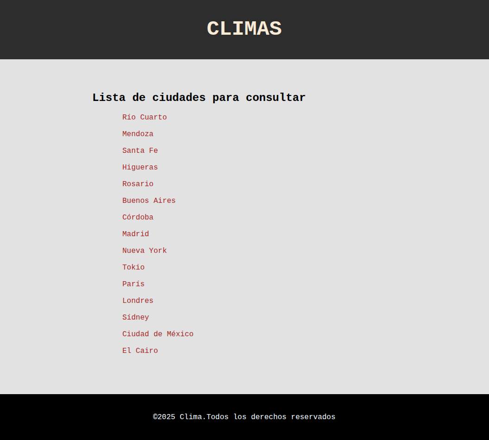
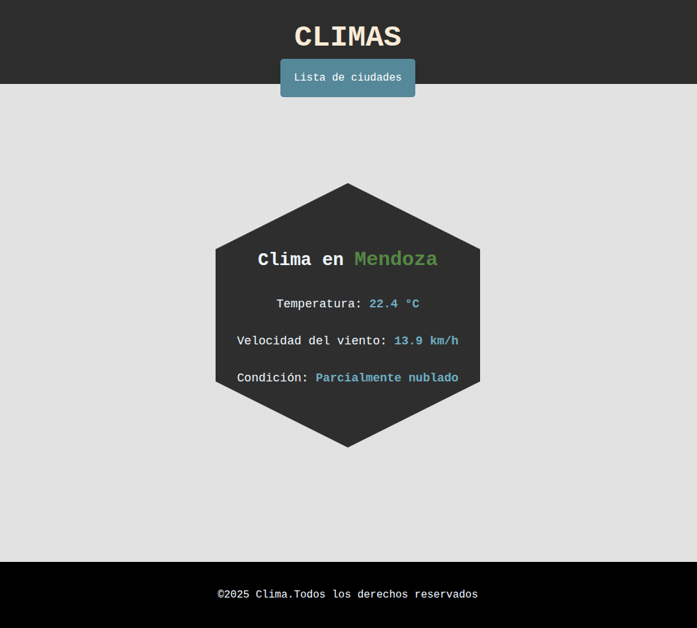

# Practico-I-Python

## Descripcion del trabajo

Creación de una aplicacion web utilizando **Flask** en el cual se seleccionara una ciudad, y gracias a una consulta con la API *Open-Meteo*
mostrar los resultados en una pagina diferente.

**API**- https://api.open-meteo.com/v1/forecast?latitude=-31.42&longitude=-64.18&current_weather=true

## Muestra del trabajo

  
  

## Documentacion
> [!NOTE]
> https://open-meteo.com/en/docs?forecast_hours=1&timezone=GMT&daily=weather_code&current=weather_code

>[!TIP]
>- Utilizacion de la pagina para crear diccionario de estados del tiempo. 
>- Recolectar lat y long para agregar mas ciudades

